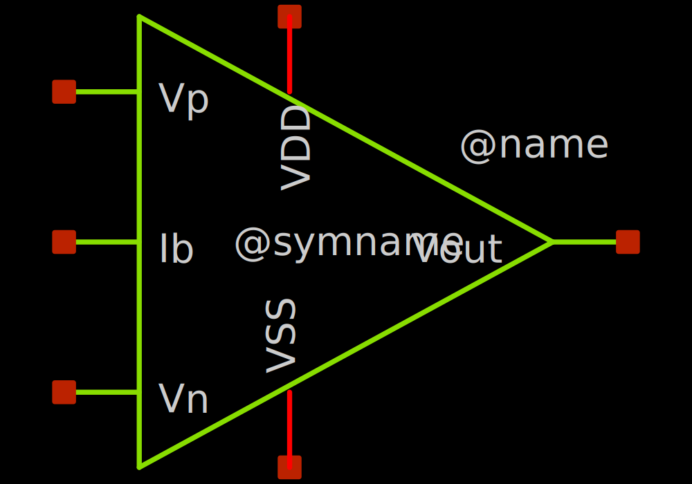
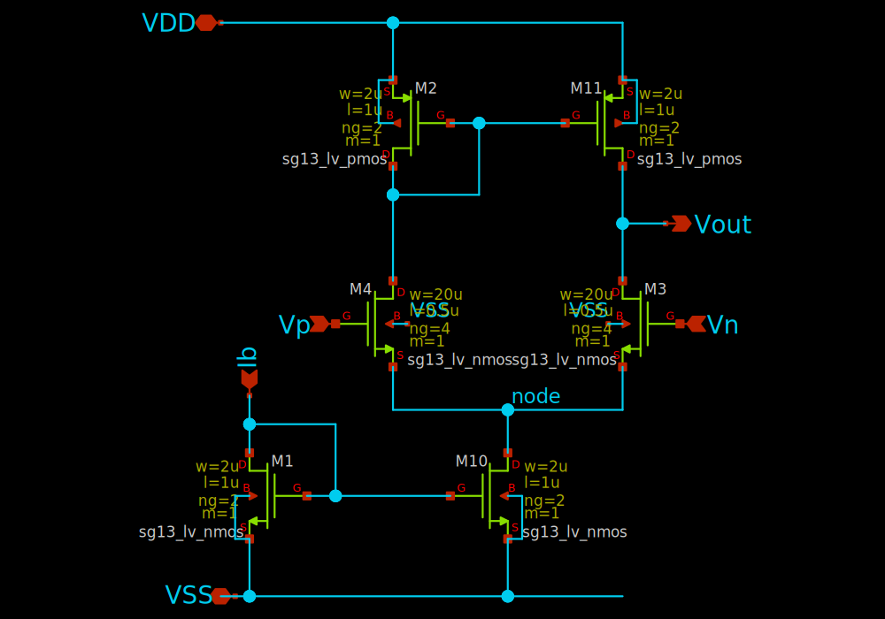
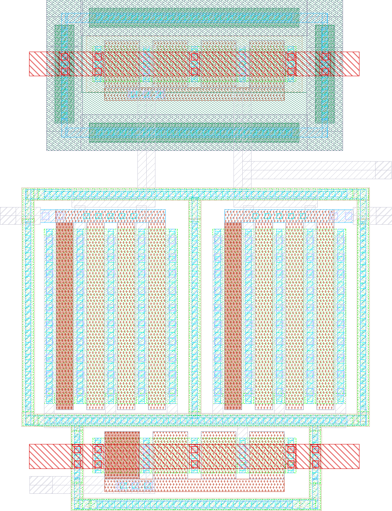
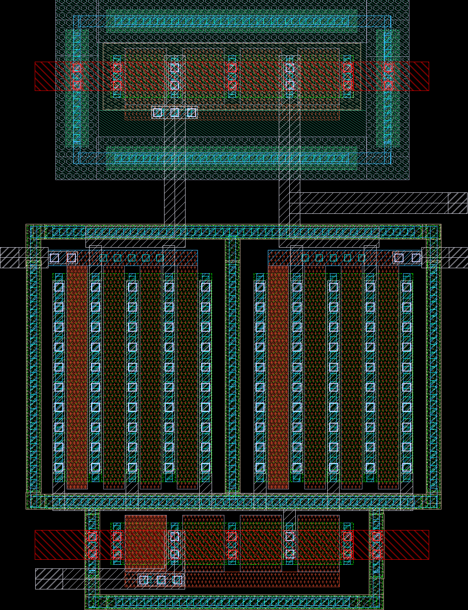

# sg13g2_leo_ip__ota5t

- Description: A simple 5-transistor OTA
- PDK: ihp-sg13g2

## Authorship

- Designer: Leo Moser
- Created: June 27, 2025
- License: Apache 2.0
- Company: None
- Last modified: None

## Pins

- VDD
  + Description: Positive analog power supply
  + Type: power
  + Direction: inout
  + Vmin: 1.4
  + Vmax: 1.6
- VSS
  + Description: Analog ground
  + Type: ground
  + Direction: inout
- Ib
  + Description: Bias current input
  + Type: signal
  + Direction: input
- Vp
  + Description: Voltage positive input
  + Type: signal
  + Direction: input
- Vn
  + Description: Voltage negative input
  + Type: signal
  + Direction: input
- Vout
  + Description: Voltage output
  + Type: signal
  + Direction: output

## Default Conditions

- vdd
  + Description: Analog power supply voltage
  + Display: Vdd
  + Unit: V
  + Typical: 1.5
- vcm
  + Description: Input common mode voltage
  + Display: Vcm
  + Unit: V
  + Typical: 0.75
- ib
  + Description: Bias current
  + Display: Ib
  + Unit: uA
  + Typical: 10
- cl
  + Description: Output load capacitance
  + Display: CLoad
  + Unit: pF
  + Maximum: 1
- corner
  + Description: Process corner
  + Display: Corner
  + Typical: mos_tt
- temperature
  + Description: Ambient temperature
  + Display: Temp
  + Unit: °C
  + Typical: 27

## Symbol

## Schematic

## Layout

