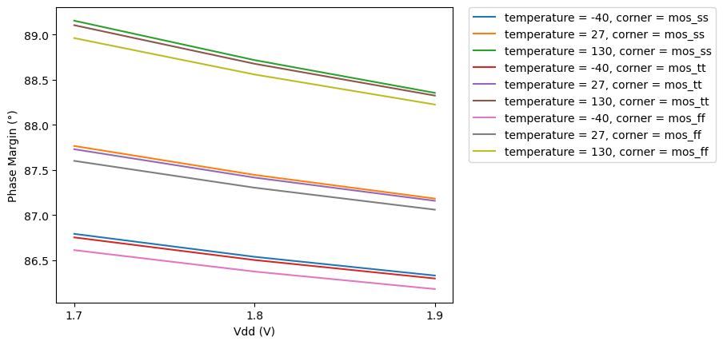

# CACE Summary for sg13g2_leo_ip__ota5t

**netlist source**: schematic

|      Parameter       |         Tool         |     Result      | Min Limit  |  Min Value   | Typ Target |  Typ Value   | Max Limit  |  Max Value   |  Status  |
| :------------------- | :------------------- | :-------------- | ---------: | -----------: | ---------: | -----------: | ---------: | -----------: | :------: |
| DC gain              | ngspice              | a0                   |          10 V/V | 19.372 V/V |          any | 30.526 V/V |          any | 44.192 V/V |   Pass ✅    |
| Unity Gain Frequency | ngspice              | ugf                  |          1e6 Hz | 15793500.000 Hz |          any | 21456100.000 Hz |          any | 27598800.000 Hz |   Pass ✅    |
| Phase Margin         | ngspice              | pm                   |            60 ° |   86.180 ° |          any |   87.416 ° |          any |   89.155 ° |   Pass ✅    |
| DC gain MC           | ngspice              | a0                   |          10 V/V | 13.153 V/V |          any | 21.038 V/V |          any | 28.895 V/V |   Pass ✅    |
| Area                 | magic_area           | area                 |               ​ |          ​ |            ​ |          ​ |      600 µm² |          ​ |   Skip 🟧    |
| Width                | magic_area           | width                |               ​ |          ​ |            ​ |          ​ |          any |          ​ |   Skip 🟧    |
| Height               | magic_area           | height               |               ​ |          ​ |            ​ |          ​ |          any |          ​ |   Skip 🟧    |
| Magic DRC            | magic_drc            | drc_errors           |               ​ |          ​ |            ​ |          ​ |            0 |          ​ |   Skip 🟧    |
| Netgen LVS           | netgen_lvs           | lvs_errors           |               ​ |          ​ |            ​ |          ​ |            0 |          ​ |   Skip 🟧    |
| KLayout DRC maximal  | klayout_drc          | drc_errors           |               ​ |          ​ |            ​ |          ​ |            0 |          ​ |   Skip 🟧    |
| Antenna Checks       | magic_antenna_check  | antenna_violations   |               ​ |          ​ |            ​ |          ​ |            0 |          ​ |   Skip 🟧    |

## Plots

## gain_vs_temp

## ugf_vs_corner

## pm_vs_vdd

## gain_mc

## transient

